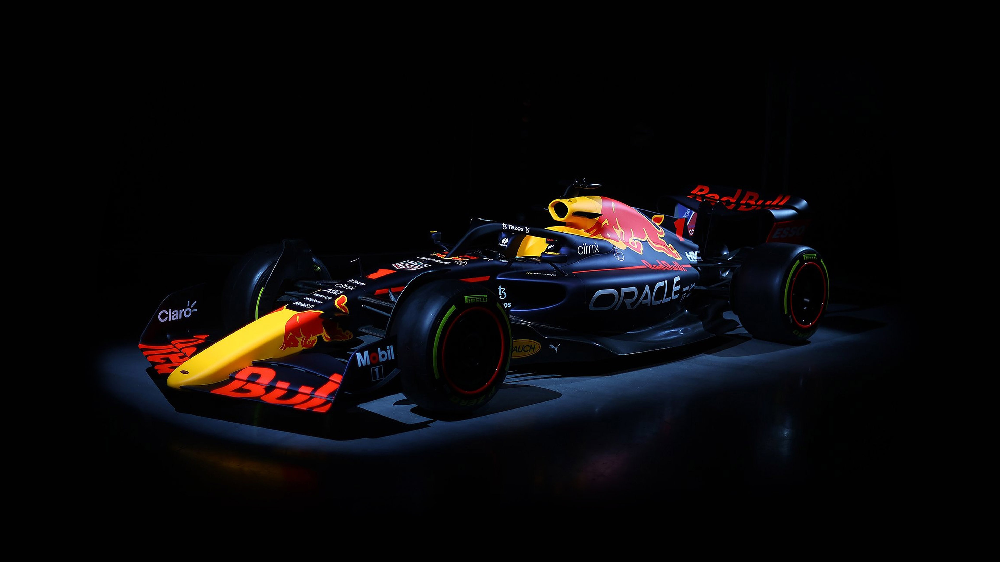

Hi there, I'm **Maneet Chatterjee**, a **Mechanical Engineering student** at **IIEST Shibpur**.  
Currently, I'm a 3rd year undergraduate 🙍🏽‍♂️ [@maneet2004](https://github.com/maneet2004),  
Kaggler 👨🏽‍💻 [@Kaggle](https://www.kaggle.com/maneetchatterjee)

**Talking about Personal Stuffs:**

- 💼 I’m pursuing a Bachelor's degree in Mechanical Engineering;
- 👨🏽‍💻 I’m currently exploring multiple domains: IoT, Robotics, Simulations, and Quantum Computing;
- 🌱 I’m currently learning Machine Learning, Deep Learning, ROS, Digital Twins, and Quantum ML;
- 🤖 My interests lie in the applications of ML/DL and Quantum Computing in Mechanical Engineering, Robotics, and Automotive systems;
- 💬 Ask me about anything tech-related — I’m always happy to help;
- 📫 Reach me at: **maneet2018@gmail.com**
- 📝 See my [Curriculum Vitae](https://drive.google.com/file/d/1UJ4YjfePSzFzEn3A_ixVTQO6Fih0FTRr/view?usp=sharing) for more info.

## 🧠 Profile

Property                 | Data  
-------------------------|------
Language / IDE           | Python, C++, Bash, MATLAB / VS Code, Jupyter, ROS tools  
Tool / Framework         | TensorFlow, PyTorch, OpenCV, PyBullet, Gazebo, InfluxDB, Grafana  
Domain Knowledge         | IoT, Robotics, Digital Twin, Predictive Maintenance, Computer Vision, Quantum Computing  
CI / CD                  | Git, GitHub Actions, Docker, MQTT, WebSockets  
Side Projects - App  | IoT-based Vibration Monitoring System, Custom ML Pipelines  
Side Projects - Web      | Grafana Dashboards for Real-time IoT Monitoring, WebSocket-MQTT Bridges  
Reach Me                 |   
